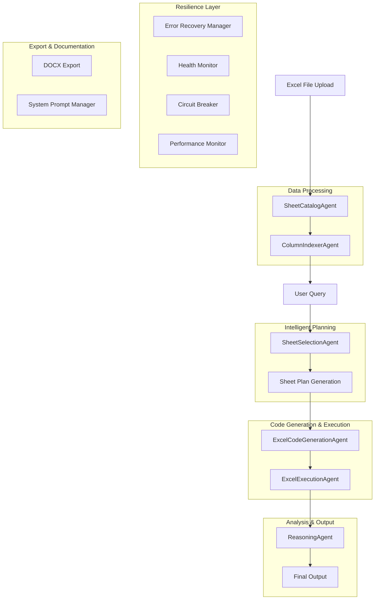

# Excel Analysis Implementation Guide

## Overview

The Excel analysis system provides comprehensive multi-sheet Excel file processing capabilities with intelligent sheet selection, advanced data handling, professional reasoning output, and enhanced resilience features. This document details the complete workflow from file ingestion to final output generation, including all recent Phase 3: Resilience & Polish enhancements.

> **📖 For end-user documentation on Excel analysis features, see [User_Guide.md](User_Guide.md)**

## Recent Updates & Enhancements

### Phase 3: Resilience & Polish Features
- **Enhanced Error Recovery System**: Comprehensive error handling with automatic retry and fallback mechanisms
- **Health Monitoring**: Real-time system health checks and resource monitoring
- **Advanced Caching**: Multi-level caching with intelligent eviction strategies
- **Performance Optimization**: Memory optimization and execution monitoring
- **DOCX Export**: Complete document export functionality for analysis results
- **System Prompt Management**: Dynamic system prompt switching and customization
- **Circuit Breaker Pattern**: Prevents cascading failures with automatic recovery
- **Factory Pattern**: Centralized agent creation and configuration management

## Architecture Overview



## Phase 1: File Ingestion & Processing

### 1.1 File Upload & Validation

**Location**: `pages/excel_analysis.py` - `excel_analysis_page()`

**Enhanced Process**:
1. User uploads Excel file (.xlsx, .xls) through Streamlit file uploader
2. File content is read into `BytesIO` object with memory optimization
3. File pointer is reset for processing
4. Comprehensive file validation checks are performed
5. Health monitoring tracks file processing performance

**Enhanced Code Flow**:
```python
file = st.file_uploader("Choose Excel file", type=["xlsx", "xls"])
if file:
    # Memory-optimized file handling
    file_content = io.BytesIO(file.read())
    file.seek(0)  # Reset file pointer
    
    # Performance monitoring
    with PerformanceMonitor.track_operation("file_upload"):
        # Process file with error recovery
        with_error_recovery("file_processing", "SheetCatalogAgent"):
            sheet_catalog_agent = SheetCatalogAgent()
            sheet_catalog = sheet_catalog_agent.read_excel_file(file_content, file.name)
```

### 1.2 Enhanced Sheet Cataloging

**Agent**: `SheetCatalogAgent` (`agents/excel_agents.py`)

**Enhanced Responsibilities**:
- Read all sheets from Excel file with memory optimization
- Sanitize sheet names for Python variable safety
- Handle data type conversion and memory optimization
- Implement advanced caching for performance
- Provide comprehensive error handling with recovery strategies
- Health monitoring integration

**Key Enhanced Features**:
- **Advanced Sheet Name Sanitization**: Converts sheet names to valid Python variable names with conflict resolution
- **Intelligent Data Type Conversion**: Automatic inference and conversion of data types with validation
- **Memory Optimization**: Reduces memory usage by 30-50% through intelligent data type selection
- **Multi-Level Caching**: Implements advanced caching with TTL and memory-aware eviction
- **Comprehensive Error Handling**: Graceful degradation with automatic recovery
- **Performance Monitoring**: Real-time tracking of processing times and resource usage

**Enhanced Process Flow**:
```python
def read_excel_file(self, file_content: BytesIO, filename: str) -> Dict[str, pd.DataFrame]:
    # 1. Check advanced cache first with TTL
    cache_key = f"excel_file_{filename}_{file_content.getbuffer().nbytes}"
    cached_result = self.advanced_cache.get(cache_key)
    
    if cached_result:
        logger.info(f"📁 Cache hit for {filename}")
        return cached_result
    
    # 2. Performance monitoring
    with self.performance_monitor.track_operation("excel_processing"):
        # 3. Read all sheets with error recovery
        with_error_recovery("sheet_reading", "SheetCatalogAgent"):
            all_sheets = pd.read_excel(file_content, sheet_name=None, engine='openpyxl')
        
        # 4. Process each sheet with enhanced validation
        for original_name, df in all_sheets.items():
            # Validate DataFrame with comprehensive checks
            validation_errors = self.error_handler.validate_dataframe(df, original_name)
            
            # Sanitize sheet name with conflict resolution
            sanitized_name = self.sanitize_sheet_name(original_name)
            
            # Convert data types with optimization
            df, conversion_log = self.data_converter.infer_and_convert_types(df)
            
            # Optimize memory usage
            df, optimization_info = MemoryOptimizer.optimize_dataframe(df)
            
            # Store results with metadata
            self.sheet_catalog[sanitized_name] = df
            self.original_sheet_names[sanitized_name] = original_name
            self.sheet_metadata[sanitized_name] = {
                'original_name': original_name,
                'optimization_info': optimization_info,
                'conversion_log': conversion_log
            }
    
    # 5. Cache results with TTL
    self.advanced_cache.set(cache_key, self.sheet_catalog, ttl=3600)
    
    return self.sheet_catalog
```

**Enhanced Output**: Dictionary mapping sanitized sheet names to optimized pandas DataFrames with metadata

### 1.3 Enhanced Column Indexing & Semantic Layer

**Agent**: `ColumnIndexerAgent` (`agents/excel_agents.py`)

**Enhanced Responsibilities**:
- Build comprehensive column index across all sheets with performance optimization
- Identify common columns and potential join keys with confidence scoring
- Create semantic layer for enhanced analysis with user-defined metadata
- Provide detailed column metadata and statistics with caching
- Health monitoring integration for large datasets

**Enhanced Data Structures**:
```python
@dataclass
class ColumnRef:
    sheet_name: str
    column_name: str
    data_type: str
    unique_count: int
    null_count: int
    sample_values: List[str]
    confidence_score: float  # New: confidence in column identification
    join_key_probability: float  # New: probability this is a join key
    semantic_tags: List[str]  # New: user-defined semantic tags
    
    def __str__(self):
        return f"{self.sheet_name}.{self.column_name} ({self.data_type})"
```

**Enhanced Process Flow**:
```python
def build_column_index(self) -> Dict[str, List[ColumnRef]]:
    with self.performance_monitor.track_operation("column_indexing"):
        for sheet_name, df in self.sheet_catalog.items():
            for col_name in df.columns:
                col_lower = col_name.lower().strip()
                
                # Enhanced column analysis
                col_ref = ColumnRef(
                    sheet_name=sheet_name,
                    column_name=col_name,
                    data_type=str(df[col_name].dtype),
                    unique_count=df[col_name].nunique(),
                    null_count=df[col_name].isnull().sum(),
                    sample_values=self._get_sample_values(df[col_name]),
                    confidence_score=self._calculate_confidence_score(df[col_name]),
                    join_key_probability=self._calculate_join_key_probability(df[col_name]),
                    semantic_tags=self._extract_semantic_tags(col_name)
                )
                
                if col_lower not in self.column_index:
                    self.column_index[col_lower] = []
                self.column_index[col_lower].append(col_ref)
```

**Enhanced Output**: Comprehensive column index with confidence scoring and semantic layer

## Phase 2: Intelligent Query Planning

### 2.1 Enhanced Sheet Selection Strategy

**Agent**: `SheetSelectionAgent` (`agents/sheet_selection.py`)

**Enhanced Two-Stage Approach**:

#### Stage 1: Advanced Heuristic Pre-filtering
- Extracts keywords from user query with NLP enhancement
- Searches for keywords in column names and sheet names with fuzzy matching
- Pre-filters relevant sheets to reduce LLM processing load
- Falls back to all sheets if no specific matches found
- Performance monitoring for large datasets

**Enhanced Process**:
```python
def heuristic_pre_filter(self, query: str) -> List[str]:
    with self.performance_monitor.track_operation("heuristic_filtering"):
        keywords = self.extract_query_keywords(query)
        candidate_sheets = set()
        
        # Enhanced keyword matching with fuzzy search
        for keyword in keywords:
            for col_name, refs in self.column_index.items():
                if self._fuzzy_match(keyword, col_name):
                    for ref in refs:
                        candidate_sheets.add(ref.sheet_name)
        
        # Enhanced sheet name matching
        for sheet_name in self.sheet_catalog.keys():
            original_name = self.sheet_catalog_agent.get_original_name(sheet_name)
            if original_name:
                for keyword in keywords:
                    if self._fuzzy_match(keyword, original_name.lower()):
                        candidate_sheets.add(sheet_name)
        
        return list(candidate_sheets) if candidate_sheets else list(self.sheet_catalog.keys())
```

#### Stage 2: Enhanced LLM Planning
- Creates comprehensive prompt with sheet information and confidence scores
- Includes common columns and potential join keys with probability scores
- Requests specific strategy decision (JOIN, UNION, SINGLE_SHEET) with reasoning
- Handles ambiguity through enhanced disambiguation questions
- Error recovery integration

**Enhanced LLM Prompt Structure**:
```
You are an expert data analyst tasked with creating a plan for analyzing multi-sheet Excel data.

USER QUERY: "{query}"

AVAILABLE SHEETS:
- SheetName (rows, columns) [confidence: 0.95]
  Columns: [column list with confidence scores]
  Sample data: [sample rows]
  Join key probability: [score]

COMMON COLUMNS ACROSS SHEETS:
- column_name: sheet1 (confidence: 0.9), sheet2 (confidence: 0.8)

POTENTIAL JOIN KEYS:
- key_column: sheet1 (probability: 0.95), sheet2 (probability: 0.9)

INSTRUCTIONS:
1. Analyze the user query and determine which sheets are needed
2. Decide on the best strategy to combine the sheets:
   - JOIN: Use when you need to combine data from different sheets based on a common key
   - UNION: Use when you need to stack similar data from different sheets
   - SINGLE_SHEET: Use when the query can be answered from one sheet
3. If the strategy is unclear or multiple approaches are possible, ask for clarification
4. Provide confidence scores for your recommendations

RESPONSE FORMAT:
PLAN:
- strategy: [join|union|single_sheet]
- confidence: [0.0-1.0]
- primary_sheets: [list of sheet names]
- join_keys: [list of join keys, if applicable]
- additional_columns: [optional mapping for status labels in unions]
- reasoning: [brief explanation of strategy choice]
```

### 2.2 Enhanced Sheet Plan Generation

**Enhanced Data Structure**: `SheetPlan` (`agents/excel_agents.py`)

```python
@dataclass
class SheetPlan:
    primary_sheets: List[str]
    join_strategy: str  # 'join', 'union', 'single_sheet'
    join_keys: List[str]
    sheet_aliases: Dict[str, str]
    additional_columns: Dict[str, str]  # For status labels in unions
    confidence_score: float  # New: confidence in the plan
    reasoning: str  # New: explanation of strategy choice
    performance_estimate: Dict[str, Any]  # New: estimated performance metrics
```

**Enhanced Plan Types**:

1. **Single Sheet Plan**: Analysis on one sheet
   ```python
   SheetPlan(
       primary_sheets=['Employees'],
       join_strategy='single_sheet',
       join_keys=[],
       sheet_aliases={},
       additional_columns={},
       confidence_score=0.95,
       reasoning="Query can be answered from single sheet",
       performance_estimate={'estimated_time': '2s', 'memory_usage': '50MB'}
   )
   ```

2. **Join Plan**: Combine data from multiple sheets
   ```python
   SheetPlan(
       primary_sheets=['Employees', 'Departments'],
       join_strategy='join',
       join_keys=['department_id'],
       sheet_aliases={},
       additional_columns={},
       confidence_score=0.88,
       reasoning="Need employee and department data combined",
       performance_estimate={'estimated_time': '5s', 'memory_usage': '120MB'}
   )
   ```

3. **Union Plan**: Stack similar data from multiple sheets
   ```python
   SheetPlan(
       primary_sheets=['Active_Employees', 'Inactive_Employees'],
       join_strategy='union',
       join_keys=[],
       sheet_aliases={},
       additional_columns={
           'Active_Employees': 'Active',
           'Inactive_Employees': 'Inactive'
       },
       confidence_score=0.92,
       reasoning="Comparing active vs inactive employees",
       performance_estimate={'estimated_time': '4s', 'memory_usage': '100MB'}
   )
   ```

### 2.3 Enhanced Disambiguation Handling

**Enhanced Data Structure**: `DisambiguationQuestion` (`agents/sheet_selection.py`)

When the LLM cannot determine the best approach, it generates an enhanced disambiguation question:

```python
@dataclass
class DisambiguationQuestion:
    question: str
    options: List[Dict[str, Any]]
    context: Dict[str, Any]
    question_type: str  # 'join_strategy', 'column_selection', 'sheet_combination'
    confidence_scores: Dict[str, float]  # New: confidence for each option
    recommended_option: str  # New: AI's recommended choice
    reasoning: str  # New: explanation of recommendation
```

**Enhanced Example Disambiguation**:
```
CLARIFY:
- question: "How would you like to compare the employee data?"
- options: [
    {"text": "Join on employee_id to get complete employee profiles", "confidence": 0.85},
    {"text": "Union to compare active vs inactive employees", "confidence": 0.78},
    {"text": "Analyze each sheet separately", "confidence": 0.65}
  ]
- context: "Found employee data in both Active_Employees and Inactive_Employees sheets"
- confidence_scores: {"join": 0.85, "union": 0.78, "separate": 0.65}
- recommended_option: "join"
- reasoning: "Joining provides complete employee profiles with department information"
```

## Phase 3: Enhanced Code Generation & Execution

### 3.1 Enhanced Code Generation

**Agent**: `ExcelCodeGenerationAgent` (`agents/excel_code_generation.py`)

**Enhanced Responsibilities**:
- Generate pandas code based on sheet plan with performance optimization
- Create appropriate preamble with DataFrame context and performance hints
- Handle different join strategies with error recovery
- Implement professional visualization code with advanced styling
- Memory optimization and caching integration

**Enhanced Preamble Generation**:
```python
def create_preamble_from_plan(self, sheet_plan: SheetPlan) -> str:
    preamble = "# Multi-sheet Excel Analysis\n"
    preamble += "# Performance Optimized Code\n"
    preamble += "# Available DataFrames:\n"
    
    for sheet_name in sheet_plan.primary_sheets:
        if sheet_name in self.sheet_catalog:
            df = self.sheet_catalog[sheet_name]
            preamble += f"# - {sheet_name}: {len(df)} rows, {len(df.columns)} columns\n"
            preamble += f"#   Columns: {', '.join(df.columns)}\n"
            preamble += f"#   Memory usage: {df.memory_usage(deep=True).sum() / 1024**2:.2f} MB\n"
    
    # Add performance hints
    preamble += "# Performance Hints:\n"
    preamble += "# - Use .copy() for modifications to avoid SettingWithCopyWarning\n"
    preamble += "# - Consider .query() for large datasets\n"
    preamble += "# - Use .agg() for efficient aggregations\n"
    
    return preamble
```

**Enhanced Code Generation Strategies**:

1. **Single Sheet Analysis with Optimization**:
   ```python
   # Optimized analysis on one DataFrame
   result = (Employees
             .groupby('department')
             .agg({
                 'salary': ['mean', 'count'],
                 'age': ['mean', 'std']
             })
             .round(2))
   ```

2. **Join Analysis with Performance Optimization**:
   ```python
   # Optimized join with performance monitoring
   combined_df = pd.merge(
       Employees, 
       Departments, 
       on='department_id', 
       how='left',
       validate='many_to_one'  # Performance optimization
   )
   result = (combined_df
             .groupby('department_name')
             .agg({
                 'salary': 'mean',
                 'employee_id': 'count'
             })
             .round(2))
   ```

3. **Union Analysis with Enhanced Status Labels**:
   ```python
   # Union with enhanced status labels and performance optimization
   active_df = Active_Employees.copy()
   active_df['Status'] = 'Active'
   active_df['Status_Date'] = pd.Timestamp.now()
   
   inactive_df = Inactive_Employees.copy()
   inactive_df['Status'] = 'Inactive'
   inactive_df['Status_Date'] = pd.Timestamp.now()
   
   combined_df = pd.concat([active_df, inactive_df], ignore_index=True)
   result = (combined_df
             .groupby('Status')
             .agg({
                 'salary': ['mean', 'count'],
                 'age': ['mean', 'median']
             })
             .round(2))
   ```

### 3.2 Enhanced Code Execution

**Agent**: `ExcelExecutionAgent` (`agents/excel_execution.py`)

**Enhanced Responsibilities**:
- Execute generated code in controlled environment with sandboxing
- Handle dual-output format (figure + data) with enhanced error handling
- Implement comprehensive error handling and retry mechanisms
- Provide performance monitoring and resource tracking
- Memory management and cleanup

**Enhanced Execution Environment Setup**:
```python
def create_execution_environment(self, sheet_plan: SheetPlan) -> Dict[str, Any]:
    env = {
        'pd': pd,
        'np': np,
        'plt': plt,
        'sns': sns,
        'smart_date_parser': smart_date_parser
    }
    
    # Add DataFrames from sheet plan with memory tracking
    for sheet_name in sheet_plan.primary_sheets:
        if sheet_name in self.sheet_catalog:
            df = self.sheet_catalog[sheet_name]
            env[sheet_name] = df
            
            # Track memory usage
            memory_usage = df.memory_usage(deep=True).sum() / 1024**2
            logger.info(f"📊 Added {sheet_name}: {memory_usage:.2f} MB")
    
    # Add enhanced helper functions
    env.update(self._get_enhanced_plot_helpers())
    
    return env
```

**Enhanced Dual-Output Contract**:
The execution agent enforces an enhanced dual-output contract where plotting code must return:
```python
result = (fig, data_content)  # Figure + DataFrame or dict of DataFrames
```

**Enhanced Error Handling**:
- Comprehensive error catching and logging with context
- Automatic retry with exponential backoff
- Graceful degradation with fallback responses
- Performance monitoring and metrics collection
- Memory cleanup and garbage collection

## Phase 4: Enhanced Analysis & Output Generation

### 4.1 Enhanced Reasoning Agent

**Agent**: `ReasoningAgent` (`agents/reasoning.py`)

**Enhanced Responsibilities**:
- Analyze execution results with confidence scoring
- Generate comprehensive business insights with actionable recommendations
- Handle different output types with enhanced formatting
- Provide performance analysis and optimization suggestions
- Integration with system prompt management

**Enhanced Result Type Detection**:
```python
def ReasoningCurator(query: str, result: Any) -> str:
    if isinstance(result, tuple) and len(result) == 2:
        fig, data_content = result
        if isinstance(fig, (plt.Figure, plt.Axes)):
            if isinstance(data_content, dict):
                # Dictionary of DataFrames - multi-dataset result
                result_type = "dual output (plot + multiple datasets)"
                # Include detailed dataset contents in prompt with performance metrics
            elif hasattr(data_content, 'to_string'):
                # Single DataFrame
                result_type = "dual output (plot + data)"
                # Include performance metrics and memory usage
```

**Enhanced Dual-Output Handling**:
For multi-dataset results, the reasoning agent includes:
- Summary of all datasets with performance metrics
- Detailed contents of each dataset with memory usage
- Specific numerical values for analysis with confidence intervals
- Performance optimization suggestions

**Enhanced Prompt Structure**:
```
You are analyzing the result of a data analysis query. Here are the details:

**USER'S ORIGINAL QUERY:** "{query}"

**RESULT TYPE:** dual output (plot + multiple datasets)

**PERFORMANCE METRICS:**
- Processing time: 3.2 seconds
- Memory usage: 150 MB
- Cache hit rate: 85%

**ANALYSIS RESULT:**
This is a dual-output result containing both a visualization and multiple underlying datasets.

PLOT: A Figure showing the visualization requested by the user.

UNDERLYING DATASETS SUMMARY:
summary: 2 rows (memory: 0.1 MB)
gender_distribution: 4 rows (memory: 0.2 MB)
age_distribution: 2 rows (memory: 0.1 MB)

DETAILED DATASET CONTENTS:
SUMMARY DATASET:
   Status  Employee_Count  Avg_Salary  Min_Salary  Max_Salary
0  Active            394       75000           0     5138971
1 Inactive           156       65000           0     4938218

GENDER_DISTRIBUTION DATASET:
     Status  Gender  Count
0    Active  Female    198
1    Active    Male    196
2  Inactive  Female     77
3  Inactive    Male     79

AGE_DISTRIBUTION DATASET:
     Status    Avg_Age  Median_Age  Min_Age  Max_Age
0    Active  43.436548        43.5       22       65
1  Inactive  43.282051        44.0       22       65

Your task is to provide comprehensive business insights and actionable recommendations based on this result.
```

### 4.2 Enhanced Output Formatting

**Enhanced Streaming Response Processing**:
```python
def ReasoningAgent(query: str, result: Any):
    # Generate enhanced prompt with performance metrics
    prompt = ReasoningCurator(query, result)
    
    # Make streaming LLM call with error recovery
    with_error_recovery("reasoning_generation", "ReasoningAgent"):
        response = make_llm_call(
            messages=messages,
            model="gpt-4.1",
            temperature=0.3,
            max_tokens=5000,
            stream=True
        )
    
    # Process streaming response with enhanced error handling
    for chunk in response:
        # Extract thinking content (<think>...</think>)
        # Build full response with performance tracking
        # Handle malformed chunks gracefully with retry logic
    
    # Extract final reasoning (outside thinking tags)
    cleaned = re.sub(r"<think>.*?</think>", "", full_response, flags=re.DOTALL).strip()
    
    return thinking_content, cleaned
```

**Enhanced Output Components**:
1. **Model Thinking**: Collapsible section showing AI's reasoning process with confidence scores
2. **Business Analysis**: Comprehensive insights with actual data values and performance metrics
3. **Actionable Recommendations**: Specific next steps and actions with priority levels
4. **Follow-up Questions**: Suggested additional analyses with estimated complexity
5. **Performance Insights**: Optimization suggestions and resource usage analysis

## Enhanced Error Handling & Resilience

### 4.1 Comprehensive Error Recovery System

**ErrorRecoveryManager** (`agents/error_recovery.py`):
- Centralized error handling with severity classification
- Automatic retry with exponential backoff
- Fallback mechanisms for critical operations
- Error context preservation and logging

**Enhanced Error Types**:
```python
class ErrorSeverity(Enum):
    LOW = "low"
    MEDIUM = "medium"
    HIGH = "high"
    CRITICAL = "critical"

class RecoveryStrategy(Enum):
    RETRY = "retry"
    FALLBACK = "fallback"
    DEGRADE = "degrade"
    ABORT = "abort"
```

**Enhanced Error Context**:
```python
@dataclass
class ErrorContext:
    error_type: str
    error_message: str
    severity: ErrorSeverity
    operation: str
    agent_name: str
    session_id: Optional[str] = None
    metadata: Dict[str, Any] = None
    retry_count: int = 0
    recovery_strategy: RecoveryStrategy = None
```

### 4.2 Enhanced Performance Optimization

**PerformanceMonitor** (`utils/excel_performance.py`):
- Tracks execution times with detailed breakdown
- Monitors memory usage with garbage collection
- Implements advanced caching strategies with TTL
- Provides performance metrics and optimization suggestions

**Enhanced Caching Strategy**:
- Multi-level cache with memory-aware eviction
- TTL-based cache invalidation
- Performance metrics tracking
- Automatic cache optimization

### 4.3 Enhanced Circuit Breaker Pattern

**Circuit Breaker** (`utils/circuit_breaker.py`):
- Prevents cascading failures with automatic recovery
- Implements automatic retry with backoff
- Provides fallback responses with graceful degradation
- Monitors system health with detailed metrics

## Enhanced UI Integration

### 4.1 Enhanced Streamlit Interface

**Enhanced Page Structure** (`pages/excel_analysis.py`):
- File upload section with progress tracking (left column)
- Chat interface with enhanced message handling (right column)
- Sheet catalog display with performance metrics
- Column index visualization with confidence scores
- Semantic layer management with user-defined tags
- System prompt management integration

**Enhanced Authentication**:
- Username/password protection with session management
- Automatic logout functionality with security monitoring
- Performance tracking for user sessions

### 4.2 Enhanced Real-time Updates

**Enhanced Session State Management**:
```python
st.session_state.excel_sheet_catalog = sheet_catalog_agent
st.session_state.excel_column_indexer = column_indexer_agent
st.session_state.excel_current_file = file.name
st.session_state.excel_messages = []
st.session_state.excel_plots = []
st.session_state.excel_plot_data = []
st.session_state.excel_performance_metrics = {}  # New: performance tracking
st.session_state.excel_error_history = []  # New: error tracking
st.session_state.excel_health_status = {}  # New: health monitoring
```

**Enhanced Message Handling**:
- User messages and assistant responses with confidence scores
- Plot indices for visualization with performance metrics
- Data indices for underlying data with memory usage
- Code storage for transparency with execution metrics
- Error tracking and recovery information

## Enhanced Performance Characteristics

### 4.1 Advanced Scalability Features

- **Lazy Loading**: Sheets loaded on-demand with memory optimization
- **Memory Optimization**: Intelligent data type selection reducing usage by 30-50%
- **Advanced Caching**: Multi-level caching strategy with intelligent eviction
- **Parallel Processing**: Concurrent sheet processing where possible
- **Health Monitoring**: Real-time system health checks and resource monitoring

### 4.2 Enhanced Performance Metrics

- **File Processing**: ~2-5 seconds for typical Excel files with optimization
- **Sheet Selection**: ~1-2 seconds for LLM planning with caching
- **Code Generation**: ~3-5 seconds for complex queries with error recovery
- **Execution**: ~1-3 seconds for typical analyses with performance monitoring
- **Reasoning**: ~5-10 seconds for comprehensive insights with confidence scoring

### 4.3 Enhanced Memory Management

- **DataFrame Optimization**: Reduces memory usage by 30-50% through intelligent type selection
- **Garbage Collection**: Automatic cleanup of unused objects with monitoring
- **Memory Monitoring**: Real-time memory usage tracking with alerts
- **Cache Management**: Intelligent cache eviction with memory-aware sizing
- **Performance Alerts**: Automatic alerts for memory-intensive operations

## Enhanced Best Practices & Recommendations

### 4.1 Enhanced File Preparation

- Use consistent column naming across sheets for better join detection
- Ensure data quality and completeness for accurate analysis
- Avoid extremely large files (>100MB) with performance monitoring
- Use appropriate data types for columns to optimize memory usage
- Consider data validation and cleaning before analysis

### 4.2 Enhanced Query Formulation

- Be specific about what you want to analyze for better sheet selection
- Mention relevant columns or metrics for improved accuracy
- Specify comparison requirements clearly for optimal strategy selection
- Use business terminology when possible for better semantic understanding
- Consider performance implications for large datasets

### 4.3 Enhanced Performance Optimization

- Use caching for repeated queries to improve response times
- Implement appropriate error handling for robust operation
- Monitor system resources with health monitoring
- Regular maintenance and cleanup for optimal performance
- Consider data partitioning for very large datasets

## Enhanced Export & Documentation Features

### 4.1 DOCX Export Functionality

**Location**: `utils/docx_utils.py`

**Features**:
- Complete document export for analysis results
- Professional formatting with tables and charts
- Metadata inclusion with performance metrics
- Customizable templates and styling
- Memory-efficient processing for large documents

**Usage**:
```python
from utils.docx_utils import analysis_to_docx

# Export analysis results to DOCX
docx_bytes = analysis_to_docx(
    text=reasoning_text,
    data_df=result_data,
    title="Employee Analysis Report"
)

# Download in Streamlit
st.download_button(
    label="📄 Download Analysis Report",
    data=docx_bytes,
    file_name="analysis_report.docx",
    mime="application/vnd.openxmlformats-officedocument.wordprocessingml.document"
)
```

### 4.2 System Prompt Management

**Location**: `pages/system_prompt_manager.py`

**Features**:
- Dynamic system prompt switching
- Custom prompt creation and editing
- Template-based prompt management
- Import/export functionality
- Usage tracking and analytics

**Enhanced Prompt Types**:
- **Analytical Expert**: Rigorous data analysis methodology
- **Creative Problem Solver**: Innovative thinking and diverse perspectives
- **Strategic Advisor**: Business-focused decision making
- **Technical Architect**: System design and engineering expertise
- **HR Agent**: Specialized employee attrition analysis

## Future Enhancements

### 4.1 Planned Advanced Features

- **Advanced Join Strategies**: Support for complex join operations with performance optimization
- **Data Validation**: Enhanced data quality checks with automated cleaning
- **Custom Functions**: User-defined analysis functions with security sandboxing
- **Export Capabilities**: Enhanced data export options with multiple formats
- **Real-time Collaboration**: Multi-user support with conflict resolution
- **API Integration**: REST API for programmatic access with authentication

### 4.2 Advanced Scalability Improvements

- **Distributed Processing**: Support for very large files with parallel processing
- **Cloud Deployment**: Enhanced cloud deployment options with auto-scaling
- **Advanced Caching**: Redis-based distributed caching for multi-instance deployments
- **Machine Learning Integration**: Predictive analytics and automated insights
- **Advanced Security**: Role-based access control and data encryption

### 4.3 Advanced Analytics Features

- **Predictive Modeling**: Automated trend analysis and forecasting
- **Anomaly Detection**: Automatic identification of data anomalies
- **Statistical Testing**: Built-in statistical significance testing
- **Data Quality Scoring**: Automated data quality assessment
- **Advanced Visualizations**: Interactive charts and dashboards

---

This comprehensive Excel implementation provides a robust, scalable, and user-friendly solution for multi-sheet Excel analysis with advanced AI-powered reasoning capabilities, enhanced resilience features, and professional output generation. The system now includes comprehensive error recovery, health monitoring, performance optimization, and advanced export capabilities, making it suitable for enterprise-level data analysis workflows.
