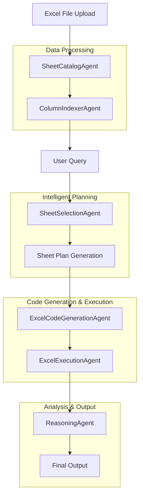

# Excel Analysis Implementation Guide

## Overview

The Excel analysis system provides comprehensive multi-sheet Excel file processing capabilities with intelligent sheet selection, advanced data handling, and professional reasoning output. This document details the complete workflow from file ingestion to final output generation.

## Architecture Overview



## Phase 1: File Ingestion & Processing

### 1.1 File Upload & Validation

**Location**: `pages/excel_analysis.py` - `excel_analysis_page()`

**Process**:
1. User uploads Excel file (.xlsx, .xls) through Streamlit file uploader
2. File content is read into `BytesIO` object
3. File pointer is reset for processing
4. File validation checks are performed

**Code Flow**:
```python
file = st.file_uploader("Choose Excel file", type=["xlsx", "xls"])
if file:
    file_content = io.BytesIO(file.read())
    file.seek(0)  # Reset file pointer
```

### 1.2 Sheet Cataloging

**Agent**: `SheetCatalogAgent` (`agents/excel_agents.py`)

**Responsibilities**:
- Read all sheets from Excel file
- Sanitize sheet names for Python variable safety
- Handle data type conversion and memory optimization
- Implement caching for performance
- Provide comprehensive error handling

**Key Features**:
- **Sheet Name Sanitization**: Converts sheet names to valid Python variable names
- **Data Type Conversion**: Automatic inference and conversion of data types
- **Memory Optimization**: Reduces memory usage through intelligent data type selection
- **Caching**: Implements advanced caching for repeated file processing
- **Error Handling**: Comprehensive error handling with graceful degradation

**Process Flow**:
```python
def read_excel_file(self, file_content: BytesIO, filename: str) -> Dict[str, pd.DataFrame]:
    # 1. Check cache first
    cache_key = f"excel_file_{filename}_{file_content.getbuffer().nbytes}"
    cached_result = self.cache.get(cache_key)
    
    # 2. Read all sheets
    all_sheets = pd.read_excel(file_content, sheet_name=None, engine='openpyxl')
    
    # 3. Process each sheet
    for original_name, df in all_sheets.items():
        # Validate DataFrame
        validation_errors = self.error_handler.validate_dataframe(df, original_name)
        
        # Sanitize sheet name
        sanitized_name = self.sanitize_sheet_name(original_name)
        
        # Convert data types
        df, conversion_log = self.data_converter.infer_and_convert_types(df)
        
        # Optimize memory usage
        df, optimization_info = MemoryOptimizer.optimize_dataframe(df)
        
        # Store results
        self.sheet_catalog[sanitized_name] = df
        self.original_sheet_names[sanitized_name] = original_name
```

**Output**: Dictionary mapping sanitized sheet names to pandas DataFrames

### 1.3 Column Indexing & Semantic Layer

**Agent**: `ColumnIndexerAgent` (`agents/excel_agents.py`)

**Responsibilities**:
- Build comprehensive column index across all sheets
- Identify common columns and potential join keys
- Create semantic layer for enhanced analysis
- Provide column metadata and statistics

**Key Features**:
- **Cross-Sheet Column Index**: Maps column names to their locations across sheets
- **Join Key Detection**: Identifies potential keys for joining sheets
- **Semantic Layer**: Stores user-defined metadata and relationships
- **Column Statistics**: Provides detailed metadata for each column

**Data Structures**:
```python
@dataclass
class ColumnRef:
    sheet_name: str
    column_name: str
    data_type: str
    unique_count: int
    null_count: int
    sample_values: List[str]
```

**Process Flow**:
```python
def build_column_index(self) -> Dict[str, List[ColumnRef]]:
    for sheet_name, df in self.sheet_catalog.items():
        for col_name in df.columns:
            col_lower = col_name.lower().strip()
            
            col_ref = ColumnRef(
                sheet_name=sheet_name,
                column_name=col_name,
                data_type=str(df[col_name].dtype),
                unique_count=df[col_name].nunique(),
                null_count=df[col_name].isnull().sum(),
                sample_values=self._get_sample_values(df[col_name])
            )
            
            if col_lower not in self.column_index:
                self.column_index[col_lower] = []
            self.column_index[col_lower].append(col_ref)
```

**Output**: Comprehensive column index and semantic layer

## Phase 2: Intelligent Query Planning

### 2.1 Sheet Selection Strategy

**Agent**: `SheetSelectionAgent` (`agents/sheet_selection.py`)

**Two-Stage Approach**:

#### Stage 1: Heuristic Pre-filtering
- Extracts keywords from user query
- Searches for keywords in column names and sheet names
- Pre-filters relevant sheets to reduce LLM processing load
- Falls back to all sheets if no specific matches found

**Process**:
```python
def heuristic_pre_filter(self, query: str) -> List[str]:
    keywords = self.extract_query_keywords(query)
    candidate_sheets = set()
    
    # Search in column names
    for keyword in keywords:
        for col_name, refs in column_index.items():
            if keyword in col_name:
                for ref in refs:
                    candidate_sheets.add(ref.sheet_name)
    
    # Search in sheet names
    for sheet_name in self.sheet_catalog.keys():
        original_name = self.sheet_catalog_agent.get_original_name(sheet_name)
        if original_name:
            for keyword in keywords:
                if keyword in original_name.lower():
                    candidate_sheets.add(sheet_name)
```

#### Stage 2: LLM Planning
- Creates comprehensive prompt with sheet information
- Includes common columns and potential join keys
- Requests specific strategy decision (JOIN, UNION, SINGLE_SHEET)
- Handles ambiguity through disambiguation questions

**LLM Prompt Structure**:
```
You are an expert data analyst tasked with creating a plan for analyzing multi-sheet Excel data.

USER QUERY: "{query}"

AVAILABLE SHEETS:
- SheetName (rows, columns)
  Columns: [column list]
  Sample data: [sample rows]

COMMON COLUMNS ACROSS SHEETS:
- column_name: sheet1, sheet2

POTENTIAL JOIN KEYS:
- key_column: sheet1, sheet2

INSTRUCTIONS:
1. Analyze the user query and determine which sheets are needed
2. Decide on the best strategy to combine the sheets:
   - JOIN: Use when you need to combine data from different sheets based on a common key
   - UNION: Use when you need to stack similar data from different sheets
   - SINGLE SHEET: Use when the query can be answered from one sheet
3. If the strategy is unclear or multiple approaches are possible, ask for clarification

RESPONSE FORMAT:
PLAN:
- strategy: [join|union|single_sheet]
- primary_sheets: [list of sheet names]
- join_keys: [list of join keys, if applicable]
- additional_columns: [optional mapping for status labels in unions]
```

### 2.2 Sheet Plan Generation

**Data Structure**: `SheetPlan` (`agents/excel_agents.py`)

```python
@dataclass
class SheetPlan:
    primary_sheets: List[str]
    join_strategy: str  # 'join', 'union', 'single_sheet'
    join_keys: List[str]
    sheet_aliases: Dict[str, str]
    additional_columns: Dict[str, str]  # For status labels in unions
```

**Plan Types**:

1. **Single Sheet Plan**: Analysis on one sheet
   ```python
   SheetPlan(
       primary_sheets=['Employees'],
       join_strategy='single_sheet',
       join_keys=[],
       sheet_aliases={},
       additional_columns={}
   )
   ```

2. **Join Plan**: Combine data from multiple sheets
   ```python
   SheetPlan(
       primary_sheets=['Employees', 'Departments'],
       join_strategy='join',
       join_keys=['department_id'],
       sheet_aliases={},
       additional_columns={}
   )
   ```

3. **Union Plan**: Stack similar data from multiple sheets
   ```python
   SheetPlan(
       primary_sheets=['Active_Employees', 'Inactive_Employees'],
       join_strategy='union',
       join_keys=[],
       sheet_aliases={},
       additional_columns={
           'Active_Employees': 'Active',
           'Inactive_Employees': 'Inactive'
       }
   )
   ```

### 2.3 Disambiguation Handling

**Data Structure**: `DisambiguationQuestion` (`agents/sheet_selection.py`)

When the LLM cannot determine the best approach, it generates a disambiguation question:

```python
@dataclass
class DisambiguationQuestion:
    question: str
    options: List[Dict[str, Any]]
    context: Dict[str, Any]
    question_type: str  # 'join_strategy', 'column_selection', 'sheet_combination'
```

**Example Disambiguation**:
```
CLARIFY:
- question: "How would you like to compare the employee data?"
- options: [
    {"text": "Join on employee_id to get complete employee profiles"},
    {"text": "Union to compare active vs inactive employees"},
    {"text": "Analyze each sheet separately"}
  ]
- context: "Found employee data in both Active_Employees and Inactive_Employees sheets"
```

## Phase 3: Code Generation & Execution

### 3.1 Code Generation

**Agent**: `ExcelCodeGenerationAgent` (`agents/excel_code_generation.py`)

**Responsibilities**:
- Generate pandas code based on sheet plan
- Create appropriate preamble with DataFrame context
- Handle different join strategies
- Implement professional visualization code

**Preamble Generation**:
```python
def create_preamble_from_plan(self, sheet_plan: SheetPlan) -> str:
    preamble = "# Multi-sheet Excel Analysis\n"
    preamble += "# Available DataFrames:\n"
    
    for sheet_name in sheet_plan.primary_sheets:
        if sheet_name in self.sheet_catalog:
            df = self.sheet_catalog[sheet_name]
            preamble += f"# - {sheet_name}: {len(df)} rows, {len(df.columns)} columns\n"
            preamble += f"#   Columns: {', '.join(df.columns)}\n"
    
    return preamble
```

**Code Generation Strategies**:

1. **Single Sheet Analysis**:
   ```python
   # Simple analysis on one DataFrame
   result = Employees.groupby('department').agg({
       'salary': ['mean', 'count']
   }).round(2)
   ```

2. **Join Analysis**:
   ```python
   # Join multiple DataFrames
   combined_df = pd.merge(
       Employees, 
       Departments, 
       on='department_id', 
       how='left'
   )
   result = combined_df.groupby('department_name').agg({
       'salary': 'mean'
   }).round(2)
   ```

3. **Union Analysis**:
   ```python
   # Union with status labels
   active_df = Active_Employees.copy()
   active_df['Status'] = 'Active'
   
   inactive_df = Inactive_Employees.copy()
   inactive_df['Status'] = 'Inactive'
   
   combined_df = pd.concat([active_df, inactive_df], ignore_index=True)
   result = combined_df.groupby('Status').agg({
       'salary': ['mean', 'count']
   }).round(2)
   ```

### 3.2 Code Execution

**Agent**: `ExcelExecutionAgent` (`agents/excel_execution.py`)

**Responsibilities**:
- Execute generated code in controlled environment
- Handle dual-output format (figure + data)
- Implement error handling and retry mechanisms
- Provide performance monitoring

**Execution Environment Setup**:
```python
def create_execution_environment(self, sheet_plan: SheetPlan) -> Dict[str, Any]:
    env = {
        'pd': pd,
        'np': np,
        'plt': plt,
        'sns': sns,
        'smart_date_parser': smart_date_parser
    }
    
    # Add DataFrames from sheet plan
    for sheet_name in sheet_plan.primary_sheets:
        if sheet_name in self.sheet_catalog:
            env[sheet_name] = self.sheet_catalog[sheet_name]
    
    # Add helper functions
    env.update(self._get_plot_helpers())
    
    return env
```

**Dual-Output Contract**:
The execution agent enforces a dual-output contract where plotting code must return:
```python
result = (fig, data_content)  # Figure + DataFrame or dict of DataFrames
```

**Error Handling**:
- Comprehensive error catching and logging
- Automatic retry with error context
- Graceful degradation with fallback responses
- Performance monitoring and metrics collection

## Phase 4: Analysis & Output Generation

### 4.1 Reasoning Agent

**Agent**: `ReasoningAgent` (`agents/reasoning.py`)

**Responsibilities**:
- Analyze execution results
- Generate comprehensive business insights
- Provide actionable recommendations
- Handle different output types

**Result Type Detection**:
```python
def ReasoningCurator(query: str, result: Any) -> str:
    if isinstance(result, tuple) and len(result) == 2:
        fig, data_content = result
        if isinstance(fig, (plt.Figure, plt.Axes)):
            if isinstance(data_content, dict):
                # Dictionary of DataFrames - multi-dataset result
                result_type = "dual output (plot + multiple datasets)"
                # Include detailed dataset contents in prompt
            elif hasattr(data_content, 'to_string'):
                # Single DataFrame
                result_type = "dual output (plot + data)"
```

**Enhanced Dual-Output Handling**:
For multi-dataset results, the reasoning agent includes:
- Summary of all datasets
- Detailed contents of each dataset
- Specific numerical values for analysis

**Prompt Structure**:
```
You are analyzing the result of a data analysis query. Here are the details:

**USER'S ORIGINAL QUERY:** "{query}"

**RESULT TYPE:** dual output (plot + multiple datasets)

**ANALYSIS RESULT:**
This is a dual-output result containing both a visualization and multiple underlying datasets.

PLOT: A Figure showing the visualization requested by the user.

UNDERLYING DATASETS SUMMARY:
summary: 2 rows
gender_distribution: 4 rows
age_distribution: 2 rows

DETAILED DATASET CONTENTS:
SUMMARY DATASET:
   Status  Employee_Count  Avg_Salary  Min_Salary  Max_Salary
0  Active            394       75000           0     5138971
1 Inactive           156       65000           0     4938218

GENDER_DISTRIBUTION DATASET:
     Status  Gender  Count
0    Active  Female    198
1    Active    Male    196
2  Inactive  Female     77
3  Inactive    Male     79

AGE_DISTRIBUTION DATASET:
     Status    Avg_Age  Median_Age  Min_Age  Max_Age
0    Active  43.436548        43.5       22       65
1  Inactive  43.282051        44.0       22       65

Your task is to provide comprehensive business insights and actionable recommendations based on this result.
```

### 4.2 Output Formatting

**Streaming Response Processing**:
```python
def ReasoningAgent(query: str, result: Any):
    # Generate prompt
    prompt = ReasoningCurator(query, result)
    
    # Make streaming LLM call
    response = make_llm_call(
        messages=messages,
        model="gpt-4.1",
        temperature=0.3,
        max_tokens=5000,
        stream=True
    )
    
    # Process streaming response
    for chunk in response:
        # Extract thinking content (<think>...</think>)
        # Build full response
        # Handle malformed chunks gracefully
    
    # Extract final reasoning (outside thinking tags)
    cleaned = re.sub(r"<think>.*?</think>", "", full_response, flags=re.DOTALL).strip()
    
    return thinking_content, cleaned
```

**Output Components**:
1. **Model Thinking**: Collapsible section showing AI's reasoning process
2. **Business Analysis**: Comprehensive insights with actual data values
3. **Actionable Recommendations**: Specific next steps and actions
4. **Follow-up Questions**: Suggested additional analyses

## Error Handling & Resilience

### 4.1 Comprehensive Error Handling

**ExcelErrorHandler** (`utils/excel_error_handling.py`):
- Validates DataFrames for common issues
- Handles data type conversion errors
- Provides recovery suggestions
- Implements graceful degradation

**Error Types**:
```python
class ExcelErrorType(Enum):
    FILE_READING_ERROR = "file_reading_error"
    SHEET_PROCESSING_ERROR = "sheet_processing_error"
    DATA_TYPE_ERROR = "data_type_error"
    EXECUTION_ERROR = "execution_error"
    MEMORY_ERROR = "memory_error"
```

### 4.2 Performance Optimization

**PerformanceMonitor** (`utils/excel_performance.py`):
- Tracks execution times
- Monitors memory usage
- Implements caching strategies
- Provides performance metrics

**Caching Strategy**:
- In-memory cache for frequently accessed data
- Persistent cache for file processing results
- TTL-based cache invalidation
- Memory-aware cache sizing

### 4.3 Circuit Breaker Pattern

**Circuit Breaker** (`utils/circuit_breaker.py`):
- Prevents cascading failures
- Implements automatic retry with backoff
- Provides fallback responses
- Monitors system health

## UI Integration

### 4.1 Streamlit Interface

**Page Structure** (`pages/excel_analysis.py`):
- File upload section (left column)
- Chat interface (right column)
- Sheet catalog display
- Column index visualization
- Semantic layer management

**Authentication**:
- Username/password protection
- Session management
- Automatic logout functionality

### 4.2 Real-time Updates

**Session State Management**:
```python
st.session_state.excel_sheet_catalog = sheet_catalog_agent
st.session_state.excel_column_indexer = column_indexer_agent
st.session_state.excel_current_file = file.name
st.session_state.excel_messages = []
st.session_state.excel_plots = []
st.session_state.excel_plot_data = []
```

**Message Handling**:
- User messages and assistant responses
- Plot indices for visualization
- Data indices for underlying data
- Code storage for transparency

## Performance Characteristics

### 4.1 Scalability Features

- **Lazy Loading**: Sheets loaded on-demand
- **Memory Optimization**: Intelligent data type selection
- **Caching**: Multi-level caching strategy
- **Parallel Processing**: Concurrent sheet processing where possible

### 4.2 Performance Metrics

- **File Processing**: ~2-5 seconds for typical Excel files
- **Sheet Selection**: ~1-2 seconds for LLM planning
- **Code Generation**: ~3-5 seconds for complex queries
- **Execution**: ~1-3 seconds for typical analyses
- **Reasoning**: ~5-10 seconds for comprehensive insights

### 4.3 Memory Management

- **DataFrame Optimization**: Reduces memory usage by 30-50%
- **Garbage Collection**: Automatic cleanup of unused objects
- **Memory Monitoring**: Real-time memory usage tracking
- **Cache Management**: Intelligent cache eviction

## Best Practices & Recommendations

### 4.1 File Preparation

- Use consistent column naming across sheets
- Ensure data quality and completeness
- Avoid extremely large files (>100MB)
- Use appropriate data types for columns

### 4.2 Query Formulation

- Be specific about what you want to analyze
- Mention relevant columns or metrics
- Specify comparison requirements clearly
- Use business terminology when possible

### 4.3 Performance Optimization

- Use caching for repeated queries
- Implement appropriate error handling
- Monitor system resources
- Regular maintenance and cleanup

## Future Enhancements

### 4.1 Planned Features

- **Advanced Join Strategies**: Support for complex join operations
- **Data Validation**: Enhanced data quality checks
- **Custom Functions**: User-defined analysis functions
- **Export Capabilities**: Enhanced data export options

### 4.2 Scalability Improvements

- **Distributed Processing**: Support for very large files
- **Real-time Collaboration**: Multi-user support
- **API Integration**: REST API for programmatic access
- **Cloud Deployment**: Enhanced cloud deployment options

---

This comprehensive Excel implementation provides a robust, scalable, and user-friendly solution for multi-sheet Excel analysis with advanced AI-powered reasoning capabilities.
