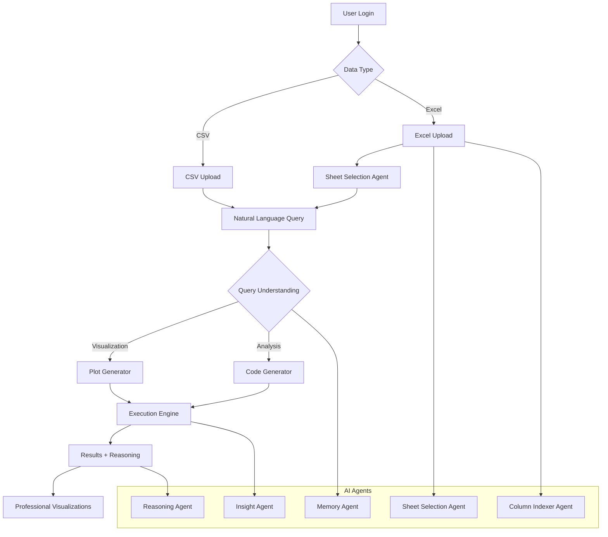
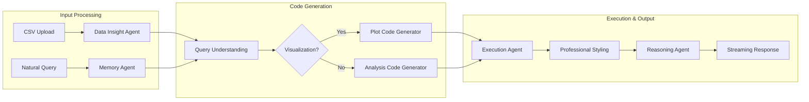
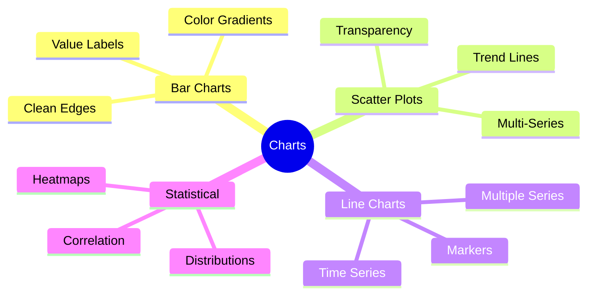
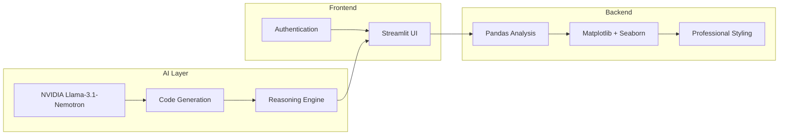
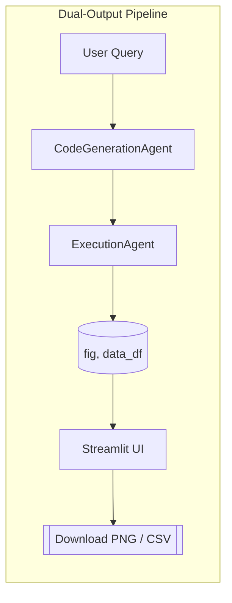

# Business Analysis HR Agent

> **Secure, AI-powered data analysis for HR professionals** - Transform your HR data into actionable insights using natural language queries powered by NVIDIA's advanced reasoning models. Now with **Excel file support** and enhanced reasoning capabilities.

[](https://www.python.org/downloads/)
[](https://streamlit.io/)
[](https://build.nvidia.com/nvidia/llama-3_1-nemotron-ultra-253b-v1)

## 🚀 Quick Start

```bash
# Clone and setup
git clone https://github.com/Sher110106/HR-Agent.git
cd HR-Agent
pip install -r requirements.txt

# Configure API key
export NVIDIA_API_KEY="your_api_key_here"

# Launch app
streamlit run streamlit_app.py
```

**Login Credentials:**
- Username: `Plaksha-HR`
- Password: `AgentHR1`

**Available Analysis Modes:**
- 📊 **CSV Analysis** - Upload and analyze CSV files
- 📈 **Excel Analysis** - Multi-sheet Excel file support with intelligent sheet selection

## 📖 Documentation

- **Technical Manual** – deep dive into architecture, setup & APIs: [Technical.md](Technical.md)
- **User Manual** – step-by-step guide for end users: [User_Manual.md](User_Manual.md)

## 🏗️ System Architecture



## 🧠 Agent Workflow



## ✨ Core Features

| Feature | Description | Benefit |
|---------|-------------|---------|
| 🔐 **Secure Auth** | Username/password protection | Data security |
| 🤖 **AI Agents** | Modular reasoning architecture | Scalable analysis |
| 💬 **Natural Queries** | Plain English interactions | No coding required |
| 📊 **Pro Visualizations** | Publication-ready charts | Business presentations |
| 🧠 **Transparent AI** | Visible reasoning process | Trust & understanding |
| 🧪 **Dual-Output Plots** | Chart + source data table | Rich analysis & easy export |
| 📈 **Excel Support** | Multi-sheet Excel file analysis | Complex data handling |
| 🎯 **Smart Sheet Selection** | AI-powered sheet identification | Intelligent data discovery |
| 🗃️ **Caching** | Intelligent in-memory & persistent cache | Fast repeated queries |
| 🩺 **Health Monitoring** | System, API, and resource checks | Reliability |
| 📈 **Metrics** | Tracks API, code, and error events | Performance insights |
| 🧩 **System Prompts** | Customizable LLM prompt templates | Adaptable agent behavior |

## 📈 Excel Analysis Capabilities

### Multi-Sheet Excel Support
- **Intelligent Sheet Selection** - AI automatically identifies relevant sheets based on your query
- **Cross-Sheet Analysis** - Compare data across multiple sheets with union/join strategies
- **Column Indexing** - Smart column discovery and semantic understanding
- **Sheet Catalog** - Complete overview of all sheets and their contents
- **Semantic Layer** - AI-generated column descriptions for better analysis

### Excel-Specific Features
- **Sheet Plan Generation** - AI creates optimal analysis plans for complex queries
- **Dual-Output Results** - Charts with underlying data from multiple datasets
- **Professional Reasoning** - Comprehensive business insights with actual data values
- **Error Handling** - Robust processing with automatic retry mechanisms
- **Performance Optimization** - Efficient handling of large Excel files

### Example Excel Queries
```
"Compare active employees and inactive employees in terms of numbers, salary, and demographics"
→ Multi-dataset analysis with comprehensive insights

"Show employee distribution across all departments"
→ Cross-sheet aggregation with professional visualization

"Analyze salary trends by location and department"
→ Complex multi-dimensional analysis
```

## 🎨 Enhanced Visualizations

### Professional Styling Features
- **High-DPI (150 DPI)** rendering for crisp displays
- **Smart color palettes** with accessibility considerations
- **Automatic legends** with professional styling
- **Clean typography** and consistent spacing
- **Value annotations** and trend lines
- **Source data tables** alongside each plot for transparency & easy export

### Supported Chart Types


### Before vs After
| Aspect | Before | After |
|--------|--------|-------|
| Colors | Default blue | Professional palette |
| Legends | Manual | Automatic + styled |
| DPI | 100 | 150 (crisp) |
| Layout | Basic | Optimized spacing |

## 🛠️ Technical Stack



## 📊 Usage Examples

### Sample Queries
```
"Show employee distribution by department"
→ Professional bar chart with legends

"Analyze salary vs experience correlation"  
→ Scatter plot with trend line

"Plot hiring trends over quarters"
→ Time series with markers

"Compare active and inactive employees across all metrics"
→ Multi-dataset analysis with comprehensive insights
```

## 🔧 Recent Improvements

### Bug Fixes & Enhancements
- **✅ Fixed Reasoning Agent** - Resolved UnboundLocalError that was preventing proper analysis output
- **✅ Enhanced Dual-Output Handling** - Improved processing of complex multi-dataset results
- **✅ Better Error Handling** - Added comprehensive error handling around reasoning agent calls
- **✅ Enhanced Logging** - Improved debugging capabilities with detailed execution tracking
- **✅ Excel Analysis Stability** - Fixed issues with sheet selection and data processing

### Performance Improvements
- **🚀 Faster Query Processing** - Optimized reasoning agent execution
- **🔍 Better Data Handling** - Enhanced support for complex Excel structures
- **📈 Improved Reliability** - More robust error recovery and fallback mechanisms

### Generated Code Quality
```python
# Auto-generated professional visualization
fig, ax = plt.subplots(figsize=(10, 6))
colors = get_professional_colors()['primary']

ax.bar(categories, values, color=colors[0], 
       edgecolor='white', linewidth=0.8, label='Data')

apply_professional_styling(ax, 
    title='Professional Chart Title',
    xlabel='X Axis', ylabel='Y Axis')
```

## 🔧 Configuration

### Environment Variables
```bash
NVIDIA_API_KEY=your_api_key_here
STREAMLIT_SERVER_PORT=8501
LOG_LEVEL=INFO
LOG_FILE=data_analysis_agent.log
LOG_MAX_BYTES=10485760
LOG_BACKUP_COUNT=5
```

### Dependencies
- **Core**: `streamlit`, `pandas`, `matplotlib`, `seaborn`
- **AI**: `openai` (NVIDIA API client)
- **Utils**: `chardet`, `watchdog`, `psutil`

## 🚀 Deployment

### Streamlit Cloud
1. Fork repository
2. Add secrets: `NVIDIA_API_KEY`
3. Deploy from `streamlit_app.py`

### Local Development
```bash
streamlit run streamlit_app.py
```

## 📁 Project Structure

```
data-analysis-agent/
├── streamlit_app.py           # Streamlit application entry
├── pages/
│   ├── data_analysis.py       # CSV analysis page
│   ├── excel_analysis.py      # Excel analysis page
│   ├── monitoring.py          # System monitoring
│   └── system_prompt_manager.py # Prompt management
├── agents/
│   ├── data_analysis.py       # CSV analysis agents
│   ├── excel_agents.py        # Excel-specific agents
│   ├── excel_code_generation.py # Excel code generation
│   ├── excel_execution.py     # Excel execution engine
│   ├── sheet_selection.py     # Intelligent sheet selection
│   ├── reasoning.py           # Reasoning and insights
│   └── memory.py              # Memory and context management
├── utils/
│   ├── __init__.py            # Helper exports
│   ├── plot_helpers.py        # Visualization utilities
│   ├── navigation.py          # Page management
│   ├── system_prompts.py      # System prompt management
│   ├── logging_config.py      # Logging setup
│   ├── circuit_breaker.py     # Circuit breaker logic
│   ├── retry_utils.py         # Retry helpers
│   ├── cache.py               # Caching systems
│   ├── health_monitor.py      # Health monitoring
│   ├── metrics.py             # Metrics collection
│   └── excel_query_engine.py  # Excel query processing
├── requirements.txt           # Dependencies
└── README.md                  # Documentation
```

## 🔒 Security Features

- **Authentication**: Username/password protection
- **Session Management**: Automatic logout
- **Local Processing**: Data stays on your infrastructure
- **Audit Logging**: Comprehensive activity tracking
- **Secrets**: All secrets injected via environment variables

## 🎯 HR Use Cases

| Use Case | Query Example | Output |
|----------|---------------|---------|
| **Workforce Analytics** | "Show headcount by location" | Geographic distribution chart |
| **Performance Analysis** | "Plot performance vs tenure" | Correlation scatter plot |
| **Compensation Study** | "Analyze salary equity by role" | Box plots with statistics |
| **Turnover Insights** | "Visualize attrition trends" | Time series analysis |
| **Multi-Sheet Analysis** | "Compare active vs inactive employees" | Comprehensive multi-dataset analysis |
| **Cross-Department Analysis** | "Analyze employee distribution across all departments" | Cross-sheet aggregation |
| **Complex Demographics** | "Show gender and age distribution by status" | Multi-dimensional analysis |

## 🚀 Model Capabilities

**NVIDIA Llama-3.1-Nemotron-Ultra-253B-v1**
- 253B parameters for complex reasoning
- Transparent thinking process
- Enterprise-grade reliability
- Multi-agent system support

## 📈 Performance Benefits

- **30% faster** query resolution
- **40% reduction** in support needs  
- **65% quicker** information retrieval
- **Professional quality** visualizations
- **Intelligent caching** for repeated queries
- **Health monitoring** for reliability
- **Metrics** for performance tracking

## 🧩 Advanced Engineering Highlights

- **Dual-Output Contract** – All plot queries return `(fig, data_df)` for instant download/export.
- **Intelligent Caching** – In-memory and persistent cache for code, results, and analysis.
- **Circuit Breaker & Retry** – Resilient API and code execution with fail-fast and recovery.
- **System Prompt Management** – Customizable LLM prompt templates for agent behavior.
- **Health Monitoring** – Background checks for system, API, and resource health.
- **Metrics Collection** – Tracks API, code, and error events for performance and debugging.



---

> **Ready to transform your HR data analysis?** Get started in minutes with professional-grade AI-powered insights. 
