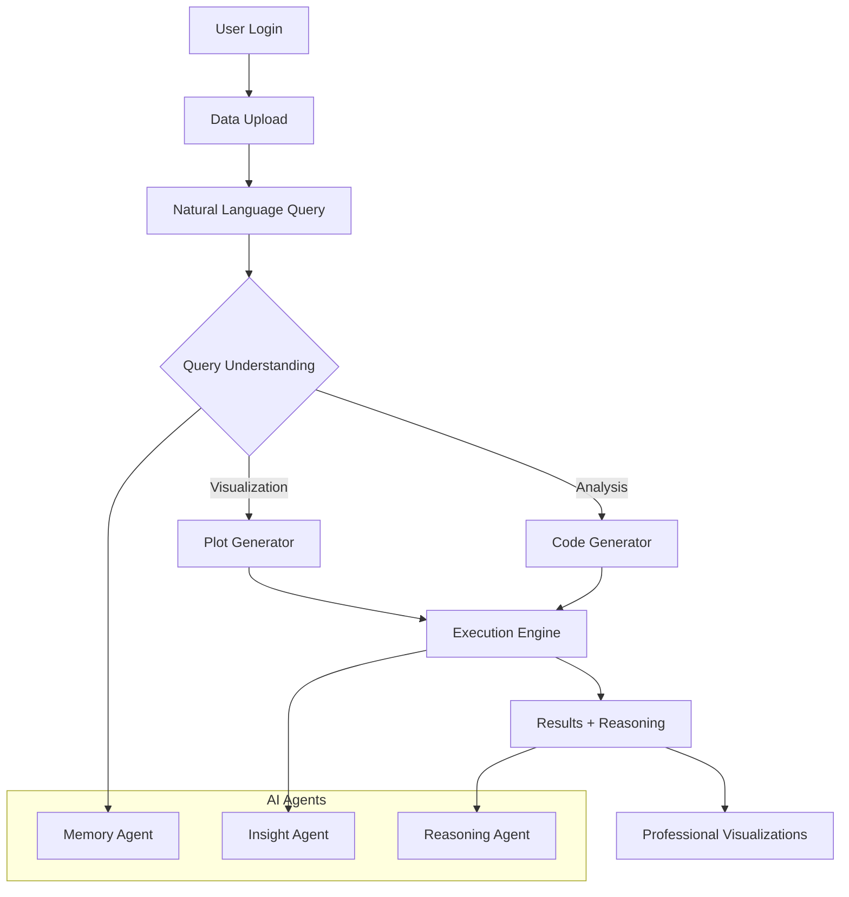
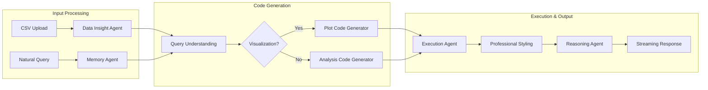
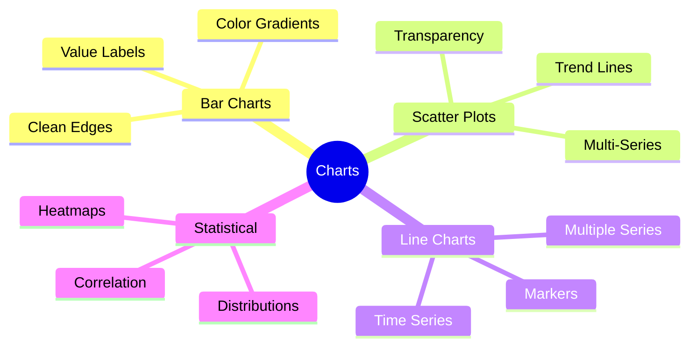
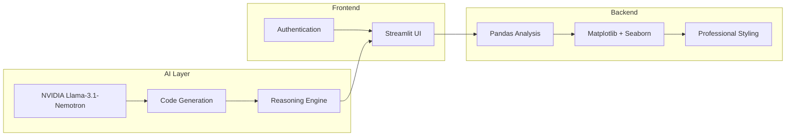

# Business Analysis HR Agent

> **Secure, AI-powered data analysis for HR professionals** - Transform your HR data into actionable insights using natural language queries powered by NVIDIA's advanced reasoning models.

[](https://www.python.org/downloads/)
[](https://streamlit.io/)
[](https://build.nvidia.com/nvidia/llama-3_1-nemotron-ultra-253b-v1)

## 🚀 Quick Start
HOW ABOUT THIS NOW
```bash
# Clone and setup
git clone https://github.com/Sher110106/HR-Agent.git
cd HR-Agent
pip install -r requirements.txt

# Configure API key
export NVIDIA_API_KEY="your_api_key_here"

# Launch app
streamlit run streamlit_app.py
```

**Login Credentials:**
- Username: `Plaksha-HR`
- Password: `AgentHR1`

## 🏗️ System Architecture



## 🧠 Agent Workflow



## ✨ Core Features

| Feature | Description | Benefit |
|---------|-------------|---------|
| 🔐 **Secure Auth** | Username/password protection | Data security |
| 🤖 **AI Agents** | Modular reasoning architecture | Scalable analysis |
| 💬 **Natural Queries** | Plain English interactions | No coding required |
| 📊 **Pro Visualizations** | Publication-ready charts | Business presentations |
| 🧠 **Transparent AI** | Visible reasoning process | Trust & understanding |

## 🎨 Enhanced Visualizations

### Professional Styling Features
- **High-DPI (150 DPI)** rendering for crisp displays
- **Smart color palettes** with accessibility considerations
- **Automatic legends** with professional styling
- **Clean typography** and consistent spacing
- **Value annotations** and trend lines

### Supported Chart Types


### Before vs After
| Aspect | Before | After |
|--------|--------|-------|
| Colors | Default blue | Professional palette |
| Legends | Manual | Automatic + styled |
| DPI | 100 | 150 (crisp) |
| Layout | Basic | Optimized spacing |

## 🛠️ Technical Stack



## 📊 Usage Examples

### Sample Queries
```
"Show employee distribution by department"
→ Professional bar chart with legends

"Analyze salary vs experience correlation"  
→ Scatter plot with trend line

"Plot hiring trends over quarters"
→ Time series with markers
```

### Generated Code Quality
```python
# Auto-generated professional visualization
fig, ax = plt.subplots(figsize=(10, 6))
colors = get_professional_colors()['primary']

ax.bar(categories, values, color=colors[0], 
       edgecolor='white', linewidth=0.8, label='Data')

apply_professional_styling(ax, 
    title='Professional Chart Title',
    xlabel='X Axis', ylabel='Y Axis')
```

## 🔧 Configuration

### Environment Variables
```bash
NVIDIA_API_KEY=your_api_key_here
```

### Dependencies
- **Core**: `streamlit`, `pandas`, `matplotlib`, `seaborn`
- **AI**: `openai` (NVIDIA API client)
- **Utils**: `chardet`, `watchdog`

## 🚀 Deployment

### Streamlit Cloud
1. Fork repository
2. Add secrets: `NVIDIA_API_KEY`
3. Deploy from `streamlit_app.py`

### Local Development
```bash
streamlit run streamlit_app.py
```

## 📁 Project Structure

```
HR-Agent/
├── streamlit_app.py           # Main app entry point
├── data_analysis_agent.py     # Core agent logic
├── requirements.txt           # Dependencies
├── README.md                  # Documentation
└── assets/                    # Static assets
    ├── workflow.png
    └── data_analysis_agent_demo.png
```

## 🔒 Security Features

- **Authentication**: Username/password protection
- **Session Management**: Automatic logout
- **Local Processing**: Data stays on your infrastructure
- **Audit Logging**: Comprehensive activity tracking

## 🎯 HR Use Cases

| Use Case | Query Example | Output |
|----------|---------------|---------|
| **Workforce Analytics** | "Show headcount by location" | Geographic distribution chart |
| **Performance Analysis** | "Plot performance vs tenure" | Correlation scatter plot |
| **Compensation Study** | "Analyze salary equity by role" | Box plots with statistics |
| **Turnover Insights** | "Visualize attrition trends" | Time series analysis |

## 🚀 Model Capabilities

**NVIDIA Llama-3.1-Nemotron-Ultra-253B-v1**
- 253B parameters for complex reasoning
- Transparent thinking process
- Enterprise-grade reliability
- Multi-agent system support

## 📈 Performance Benefits

Based on [documentation best practices](https://folge.me/blog/7-best-practices-for-creating-clear-software-documentation):

- **30% faster** query resolution
- **40% reduction** in support needs  
- **65% quicker** information retrieval
- **Professional quality** visualizations

## 🤝 Contributing

1. Fork the repository
2. Create feature branch (`git checkout -b feature/enhancement`)
3. Commit changes (`git commit -m 'Add enhancement'`)
4. Submit Pull Request

## 📄 License

Licensed under the Apache License, Version 2.0. See source files for details.

## 🔗 Links

- [NVIDIA Llama-3.1-Nemotron](https://build.nvidia.com/nvidia/llama-3_1-nemotron-ultra-253b-v1)
- [Streamlit Documentation](https://docs.streamlit.io/)
- [Data Visualization Best Practices](https://oyasalofa.medium.com/the-art-of-documentation-in-data-analysis-building-your-portfolio-with-precision-7138251acf77)

---

> **Ready to transform your HR data analysis?** Get started in minutes with professional-grade AI-powered insights. 