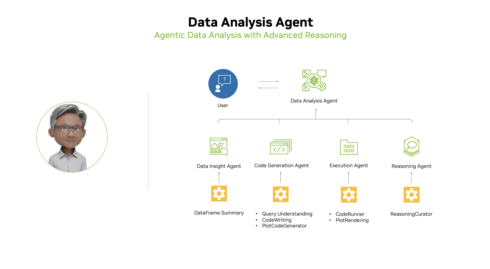

# Business Analysis HR Agent

An interactive, authenticated business analysis application that leverages advanced LLM reasoning to help HR professionals explore, visualize, and understand their data using NVIDIA Llama-3.1-Nemotron-Ultra-253B-v1.

## Overview

This repository contains a Streamlit application that demonstrates a complete workflow for HR data analysis with secure authentication:

1. **Secure Login**: Authentication system with username/password protection
2. **Data Upload**: Upload CSV files for analysis
3. **Natural Language Queries**: Ask questions about your data in plain English
4. **Automated Visualization**: Generate relevant plots and charts
5. **Transparent Reasoning**: Get detailed explanations of the analysis process

The implementation leverages the powerful Llama-3.1-Nemotron-Ultra-253B-v1 model through NVIDIA's API, enabling sophisticated data analysis and reasoning specifically tailored for HR business intelligence.

Learn more about the model [here](https://developer.nvidia.com/blog/build-enterprise-ai-agents-with-advanced-open-nvidia-llama-nemotron-reasoning-models/).

## Features

- **🔐 Secure Authentication**: Login system to protect sensitive HR data
- **🤖 Agentic Architecture**: Modular agents for data insight, code generation, execution, and reasoning
- **💬 Natural Language Queries**: Ask questions about your data—no coding required
- **📊 Automated Visualization**: Instantly generate and display relevant plots
- **🧠 Transparent Reasoning**: Get clear, LLM-generated explanations for every result
- **⚡ Powered by NVIDIA Llama-3.1-Nemotron-Ultra-253B-v1**: State-of-the-art reasoning and interpretability



## Authentication

The application includes a secure login system:
- **Username**: `Plaksha-HR`
- **Password**: `AgentHR1`

Only authenticated users can access the data analysis features, ensuring sensitive HR information remains protected.

## Requirements

- Python 3.10+
- Streamlit
- NVIDIA API Key (see [Installation](#installation) section for setup instructions)
- Required Python packages (see `requirements.txt`):
  - pandas
  - matplotlib
  - streamlit
  - openai
  - chardet
  - numpy

## Installation

### Local Development

1. Clone this repository:
   ```bash
   git clone https://github.com/Sher110106/HR-Agent.git
   cd HR-Agent
   ```

2. Install dependencies:
   ```bash
   pip install -r requirements.txt
   ```

3. Set up your NVIDIA API key:
   - Sign up or log in at [NVIDIA Build](https://build.nvidia.com/nvidia/llama-3_1-nemotron-ultra-253b-v1?integrate_nim=true&hosted_api=true&modal=integrate-nim)
   - Generate an API key
   - Set the API key in your environment:
     ```bash
     export NVIDIA_API_KEY=your_nvidia_api_key_here
     ```

4. Run the application:
   ```bash
   streamlit run streamlit_app.py
   ```

### Streamlit Community Cloud Deployment

This application is configured for easy deployment on [Streamlit Community Cloud](https://streamlit.io/cloud):

1. **Repository Setup**: Fork or use this repository
2. **Secrets Management**: In your Streamlit Community Cloud app settings, add your secrets:
   ```toml
   NVIDIA_API_KEY = "your_nvidia_api_key_here"
   ```
3. **Deploy**: The app will automatically use `streamlit_app.py` as the entry point

For detailed deployment instructions, see the [Streamlit Community Cloud documentation](https://docs.streamlit.io/deploy/streamlit-community-cloud).

## Usage

1. **Login**: Enter the authentication credentials:
   - Username: `Plaksha-HR`
   - Password: `AgentHR1`

2. **Upload Data**: Upload a CSV file containing your HR data (e.g., employee records, performance metrics, attendance data)

3. **Ask Questions**: Use natural language to explore your data:
   - "Show me the distribution of employees by department"
   - "What's the correlation between experience and salary?"
   - "Create a visualization of performance trends over time"

4. **View Results**: Get instant visualizations, statistical analysis, and detailed reasoning for every query

## Example HR Use Cases

- **Employee Analytics**: Analyze workforce demographics, tenure, and turnover
- **Performance Analysis**: Visualize performance metrics and identify trends
- **Compensation Studies**: Examine salary distributions and pay equity
- **Attendance Patterns**: Track and visualize attendance and leave patterns
- **Hiring Insights**: Analyze recruitment data and hiring success rates

## Security Features

- **Authentication Protection**: Secure login prevents unauthorized access
- **Session Management**: Automatic logout and session cleanup
- **Local Processing**: All data analysis happens locally—no data sent to external services except for LLM queries
- **Audit Logging**: Comprehensive logging of user activities and system events

## Model Details

The Llama-3.1-Nemotron-Ultra-253B-v1 model used in this project:
- **Parameters**: 253B
- **Features**: Advanced reasoning capabilities, transparent thinking process
- **Use Cases**: Complex data analysis, multi-agent systems, business intelligence
- **Enterprise Ready**: Optimized for production deployment with robust error handling

## File Structure

```
HR-Agent/
├── streamlit_app.py         # Main application file
├── data_analysis_agent.py   # Original development file
├── requirements.txt         # Python dependencies
├── README.md               # This file
├── .gitignore             # Git ignore patterns
└── assets/                # Application assets
    ├── workflow.png
    └── data_analysis_agent_demo.png
```

## Deployment Notes

- **Entry Point**: The app uses `streamlit_app.py` as the main entry point for optimal Community Cloud compatibility
- **Environment Variables**: Set `NVIDIA_API_KEY` in your deployment environment
- **Dependencies**: All required packages are listed in `requirements.txt`
- **Python Version**: Compatible with Python 3.10+ (Community Cloud default: 3.12)

## Contributing

Contributions are welcome! Please:
1. Fork the repository
2. Create a feature branch
3. Make your changes
4. Submit a pull request

## Acknowledgments

- [NVIDIA Llama-3.1-Nemotron-Ultra-253B-v1](https://build.nvidia.com/nvidia/llama-3_1-nemotron-ultra-253b-v1)
- [Streamlit](https://streamlit.io/)
- [Streamlit Community Cloud](https://streamlit.io/cloud)
- [Pandas](https://pandas.pydata.org/)
- [Matplotlib](https://matplotlib.org/)

## License

Licensed under the Apache License, Version 2.0. See the license header in the source files for details.
