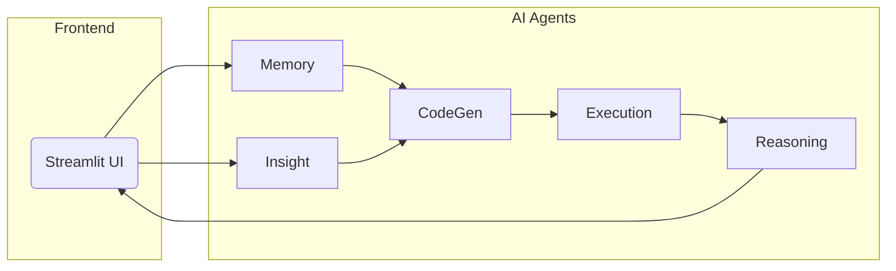

# Technical Manual – Business Analysis HR Agent

> **Version 0.3**  
> Last updated: {{DATE}}

---

## Table of Contents
1. [Introduction](#introduction)
2. [Target Audience](#target-audience)
3. [Conceptual Overview](#conceptual-overview)
4. [System Architecture](#system-architecture)
5. [Environment Setup](#environment-setup)
6. [Configuration](#configuration)
7. [Project Structure](#project-structure)
8. [Application Layers](#application-layers)
9. [Data-Flow Walkthrough](#data-flow-walkthrough)
10. [Agent & API Reference](#agent--api-reference)
11. [Error Handling & Resilience](#error-handling--resilience)
12. [Logging & Monitoring](#logging--monitoring)
13. [Testing Strategy](#testing-strategy)
14. [Deployment Guides](#deployment-guides)
15. [Scalability & Performance](#scalability--performance)
16. [Security Considerations](#security-considerations)
17. [Contribution Guidelines](#contribution-guidelines)
18. [Glossary](#glossary)

---

## Introduction
The **Business Analysis HR Agent** is an AI-powered data-analysis platform that converts HR datasets into actionable insights using natural language queries. This manual documents the internal architecture, codebase layout, and operational procedures required to develop, maintain, and deploy the system.

## Target Audience
* Full-stack engineers integrating new features.
* DevOps / SRE teams responsible for deployment & uptime.
* Data scientists extending analysis capabilities.

Readers are expected to be comfortable with Python 3.10+, virtual environments, and containerised deployments.

## Conceptual Overview
The application follows a **multi-agent micro-kernel** pattern:
* **Memory Agent** – retrieves historical context from vector storage.
* **Insight Agent** – surfaces descriptive statistics & data summaries.
* **Code Generation Agents** – translate NL queries into Python/SQL.
* **Execution Agent** – runs generated code in a sandbox.
* **Reasoning Agent** – streams explanations and results back to the UI.

This loose coupling allows independent scaling and rapid iteration.

## System Architecture


### Key Packages
| Path | Responsibility |
|------|----------------|
| `agents/` | Agent implementations & coordination |
| `app_core/` | Generic API wrappers & helper functions |
| `utils/` | Cross-cutting utilities (logging, retries, cache, …) |
| `pages/` | Streamlit page controllers |

## Environment Setup
```bash
# Clone & enter repo
$ git clone https://github.com/Sher110106/HR-Agent.git
$ cd HR-Agent

# Create & activate venv
$ python -m venv .venv && source .venv/bin/activate

# Install deps
$ pip install -r requirements.txt

# Export secrets
$ export NVIDIA_API_KEY="<your-key>"
```

## Configuration
All runtime settings are centralised in environment variables. See **Configuration** section of the `README.md` for an exhaustive list.

| Variable | Description | Default |
|----------|-------------|---------|
| `NVIDIA_API_KEY` | Auth key for model endpoint | — |
| `STREAMLIT_SERVER_PORT` | Local dev port | `8501` |
| `LOG_LEVEL` | Python logging level | `INFO` |

## Project Structure
```text
data-analysis-agent/
├── agents/            # AI agent definitions
├── app_core/          # Core business logic & helpers
├── pages/             # Streamlit UI pages
├── utils/             # Shared utilities (retry, cache, …)
├── tests/             # Pytest suite
└── streamlit_app.py   # Entrypoint
```

## Application Layers
1. **Presentation** – Streamlit pages & widgets.
2. **Orchestration** – `agents.execution` coordinates agent calls.
3. **Domain Logic** – `app_core.helpers` & `app_core.api` provide data-wrangling helpers.
4. **Infrastructure** – `utils.*` offers logging, circuit breakers, retries, caching.

## Data-Flow Walkthrough
1. **Upload CSV** → persisted to session cache.
2. **Natural query** sent to **Memory Agent** for context retrieval.
3. **Insight Agent** produces schema & stats.
4. Combined prompt feeds **CodeGen Agents**.
5. Generated code executed in **Execution Agent** inside `exec_safe` sandbox.
6. Results streamed to UI while **Reasoning Agent** explains steps.

## Agent & API Reference
### `agents/code_generation.py`
* `generate_plot_code(prompt: str) -> str`
* `generate_analysis_code(prompt: str) -> str`

### `app_core/api.py`
* `run_code(code: str, globals: dict) -> Any` – sandboxed exec.

(See inline docstrings for parameters & return types.)

## Error Handling & Resilience
The platform employs:
* **Retry utils** (`utils/retry_utils.py`) with exponential backoff.
* **Circuit breaker** (`utils/circuit_breaker.py`) to shed load after N failures.
* **Graceful degradation** – the UI surfaces friendly errors & traceback links.

## Logging & Monitoring
* Structured JSON logs via `utils/logging_config.py`.
* **Prometheus**-style metrics produced by `utils/metrics.py`.
* **Health endpoints** in `utils/health_monitor.py`.

## Testing Strategy
* Unit tests live in `tests/` and are executed with `pytest`.
* **Integration test**: `tests/test_integration.py` loads a small CSV and runs an end-to-end query.

Run locally:
```bash
pytest -q
```

## Deployment Guides
### Docker (recommended)
```bash
docker build -t hr-agent:latest .
docker run -p 8501:8501 -e NVIDIA_API_KEY=xxx hr-agent:latest
```

### Streamlit Community Cloud
1. Fork repo & connect to Streamlit Cloud.
2. Set `NVIDIA_API_KEY` secret.
3. Deploy `streamlit_app.py`.

## Scalability & Performance
* Stateless Streamlit instances behind a load-balancer.
* Cache long-lived embeddings in Redis.
* GPU inference endpoint autoscaled based on QPS.
* Use **chunked streaming** to keep UI responsive.

## Security Considerations
* All data processed **in-memory** – nothing written to disk.
* Frontend protected by password (basic HTTP auth can be added for prod).
* Secrets injected via env vars, never committed.

## Contribution Guidelines
* Follow **PEP 8** & **Black** formatting (`black .`).
* Commit messages: `<scope>: <concise description>`.
* Ensure `pytest` passes & `pre-commit` hooks run.

## Glossary
| Term | Definition |
|------|------------|
| **Agent** | Autonomous unit responsible for a single reasoning task. |
| **Context Window** | Token budget available to LLM during a prompt. |
| **Dual-Output Plot** | `(fig, data_df)` tuple used for chart + data table. |

---

> Documentation created following best practices outlined in [“Creating a Technical Manual”](https://document360.com/blog/technical-manual/) [[source](https://document360.com/blog/technical-manual/)].
