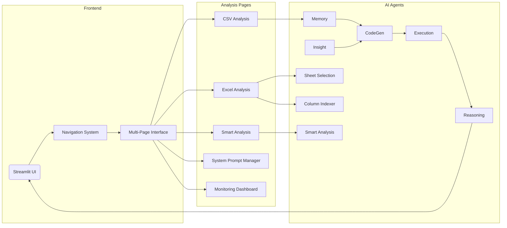

# Technical Manual – Business Analysis HR Agent

> **Version 0.5**  
> Last updated: January 2025

---

## Table of Contents
1. [Introduction](#introduction)
2. [Target Audience](#target-audience)
3. [Conceptual Overview](#conceptual-overview)
4. [System Architecture](#system-architecture)
5. [Environment Setup](#environment-setup)
6. [Configuration](#configuration)
7. [Project Structure](#project-structure)
8. [Application Layers](#application-layers)
9. [Data-Flow Walkthrough](#data-flow-walkthrough)
10. [Agent & API Reference](#agent--api-reference)
11. [Error Handling & Resilience](#error-handling--resilience)
12. [Logging & Monitoring](#logging--monitoring)
13. [Caching & Performance](#caching--performance)
14. [Testing Strategy](#testing-strategy)
15. [Deployment Guides](#deployment-guides)
16. [Scalability & Performance](#scalability--performance)
17. [Security Considerations](#security-considerations)
18. [Contribution Guidelines](#contribution-guidelines)
19. [Glossary](#glossary)

---

## Introduction
The **Business Analysis HR Agent** is an AI-powered data-analysis platform that converts HR datasets into actionable insights using natural language queries. This manual documents the internal architecture, codebase layout, and operational procedures required to develop, maintain, and deploy the system.

> **📖 For end-user documentation and practical usage guides, see [User_Guide.md](User_Guide.md)**

## Target Audience
* Full-stack engineers integrating new features.
* DevOps / SRE teams responsible for deployment & uptime.
* Data scientists extending analysis capabilities.

Readers are expected to be comfortable with Python 3.10+, virtual environments, and containerised deployments.

## Recent Updates
* **Multi-Modal Analysis** - Added Smart Analysis page with PandasAI integration for enhanced reasoning
* **Excel Multi-Sheet Support** - Comprehensive Excel file processing with intelligent sheet selection and column indexing
* **Advanced Monitoring** - Real-time health monitoring dashboard with metrics collection
* **System Prompt Management** - Dynamic prompt customization for different analysis styles
* **Enhanced Error Recovery** - Improved error handling with automatic retry mechanisms
* **DOCX Export Feature** - Added comprehensive DOCX download functionality for all text and data exports using python-docx library

## Conceptual Overview
The application follows a **multi-agent micro-kernel** pattern with enhanced capabilities:
* **Memory Agent** – retrieves and stores column descriptions, manages system prompts, and maintains conversation context.
* **Insight Agent** – surfaces descriptive statistics & data summaries.
* **Code Generation Agents** – translate NL queries into Python/SQL, select between plotting and analysis code, and orchestrate prompt context.
* **Execution Agent** – runs generated code in a sandbox, validates code, and supports dual-output (plot + data) contract.
* **Reasoning Agent** – streams explanations and results back to the UI, curates business insights, and handles error explanations.
* **Sheet Selection Agent** – intelligently selects and processes Excel sheets based on user queries.
* **Column Indexer Agent** – creates semantic layer for Excel column mapping and analysis.
* **Smart Analysis Agent** – leverages PandasAI for enhanced reasoning and natural language data exploration.

This loose coupling allows independent scaling and rapid iteration.

## System Architecture


### Key Packages
| Path | Responsibility |
|------|----------------|
| `agents/` | Agent implementations & coordination |
| `app_core/` | Generic API wrappers & helper functions |
| `utils/` | Cross-cutting utilities (logging, retries, cache, circuit breaker, health, metrics, navigation, system prompts, plot helpers, docx utils, excel handling) |
| `pages/` | Streamlit page controllers |

## Environment Setup
```bash
# Clone & enter repo
$ git clone https://github.com/Sher110106/HR-Agent.git
$ cd HR-Agent

# Create & activate venv
$ python -m venv .venv && source .venv/bin/activate

# Install deps
$ pip install -r requirements.txt

# Export secrets
$ export NVIDIA_API_KEY="<your-key>"
$ export AZURE_API_KEY="<your-azure-key>"
$ export AZURE_ENDPOINT="<your-azure-endpoint>"
```

## Configuration
All runtime settings are centralised in environment variables. See **Configuration** section of the `README.md` for an exhaustive list.

| Variable | Description | Default |
|----------|-------------|---------|
| `NVIDIA_API_KEY` | Auth key for NVIDIA model endpoint | — |
| `AZURE_API_KEY` | Auth key for Azure OpenAI endpoint | — |
| `AZURE_ENDPOINT` | Azure OpenAI endpoint URL | — |
| `AZURE_API_VERSION` | Azure API version | `2024-02-15-preview` |
| `AZURE_DEPLOYMENT_NAME` | Azure deployment name | `gpt-4` |
| `STREAMLIT_SERVER_PORT` | Local dev port | `8501` |
| `LOG_LEVEL` | Python logging level | `INFO` |
| `LOG_FILE` | Log file path | `data_analysis_agent.log` |
| `LOG_MAX_BYTES` | Max log file size before rotation | `10485760` |
| `LOG_BACKUP_COUNT` | Number of backup log files | `5` |

## Project Structure
```text
HR-Agent/
├── agents/            # AI agent definitions
│   ├── base_agent.py
│   ├── code_generation.py
│   ├── execution.py
│   ├── reasoning.py
│   ├── memory.py
│   ├── data_analysis.py
│   ├── excel_agents.py
│   ├── excel_code_generation.py
│   ├── excel_execution.py
│   ├── sheet_selection.py
│   ├── coordinator.py
│   ├── error_recovery.py
│   ├── factory.py
│   └── code_templates.py
├── app_core/          # Core business logic & helpers
├── pages/             # Streamlit UI pages
│   ├── data_analysis.py
│   ├── excel_analysis.py
│   ├── smart_analysis.py
│   ├── system_prompt_manager.py
│   └── monitoring.py
├── utils/             # Shared utilities
│   ├── plot_helpers.py
│   ├── navigation.py
│   ├── metrics.py
│   ├── health_monitor.py
│   ├── cache.py
│   ├── circuit_breaker.py
│   ├── logging_config.py
│   ├── system_prompts.py
│   ├── docx_utils.py
│   ├── excel_error_handling.py
│   ├── excel_performance.py
│   ├── excel_query_engine.py
│   ├── plot_quality_system.py
│   └── retry_utils.py
├── tests/             # Pytest suite
└── streamlit_app.py   # Entrypoint
```

## Application Layers
1. **Presentation** – Streamlit pages & widgets, navigation registry with multi-page interface.
2. **Orchestration** – `agents.execution` coordinates agent calls, circuit breaker and retry logic for resilience.
3. **Domain Logic** – `app_core.helpers` & `app_core.api` provide data-wrangling helpers.
4. **Infrastructure** – `utils.*` offers logging, circuit breakers, retries, caching, health monitoring, metrics, and system prompt management.

## Data-Flow Walkthrough
1. **Upload CSV/Excel** → persisted to session cache with format-specific processing.
2. **Natural query** sent to **Memory Agent** for context retrieval (column descriptions, conversation, system prompt).
3. **Insight Agent** produces schema & stats.
4. **Sheet Selection Agent** (Excel only) intelligently selects relevant sheets.
5. **Column Indexer Agent** (Excel only) creates semantic layer for column mapping.
6. Combined prompt feeds **CodeGen Agents** (QueryUnderstandingTool, PlotCodeGeneratorTool, CodeWritingTool, CodeGenerationAgent).
7. Generated code executed in **Execution Agent** inside `exec_safe` sandbox, with code validation and dual-output (fig, data_df) support.
8. Results streamed to UI while **Reasoning Agent** explains steps and business context.
9. **Smart Analysis Agent** (optional) provides enhanced reasoning using PandasAI.
10. Caching, metrics, and health monitoring run in the background for performance and reliability.

## Agent & API Reference
### `agents/code_generation.py`
- `QueryUnderstandingTool(query: str, conversation_context: str = "") -> bool` – Classifies if a query needs a visualization.
- `PlotCodeGeneratorTool(cols: List[str], query: str, df: pd.DataFrame, conversation_context: str = "", memory_agent: ColumnMemoryAgent = None) -> str` – Generates LLM prompt for plotting code.
- `CodeWritingTool(cols: List[str], query: str, df: pd.DataFrame, conversation_context: str = "", memory_agent: ColumnMemoryAgent = None) -> str` – Generates LLM prompt for pandas-only code.
- `CodeGenerationAgent(query: str, df: pd.DataFrame, chat_history: List[Dict] = None, memory_agent: ColumnMemoryAgent = None, retry_context: str = None)` – Orchestrates code generation, prompt context, and caching.

### `agents/execution.py`
- `validate_pandas_code(code: str) -> tuple[list, str]` – Validates code for common pandas errors and suggests fixes.
- `ExecutionAgent(code: str, df: pd.DataFrame, should_plot: bool)` – Executes code in a controlled environment, supports dual-output (fig, data_df).

### `agents/reasoning.py`
- `ReasoningCurator(query: str, result: Any) -> str` – Crafts LLM prompt for business insight reasoning.
- `ReasoningAgent(query: str, result: Any)` – Streams LLM reasoning and explanation, including error handling.

### `agents/memory.py`
- `ColumnMemoryAgent` – Stores and retrieves AI-generated column descriptions.
- `SystemPromptMemoryAgent` – Manages dynamic system prompts, applies active prompt context.
- `ConversationMemoryTool(messages: List[Dict[str, str]], max_history: int = 4) -> str` – Returns last N chat turns as context.
- `enhance_prompt_with_context(base_prompt: str, system_prompt_agent: SystemPromptMemoryAgent) -> str` – Helper to enhance prompts with system context.

### `agents/data_analysis.py`
- `DataFrameSummaryTool(df: pd.DataFrame) -> str` – Summarizes DataFrame for LLM.
- `DataInsightAgent(df: pd.DataFrame, make_llm_call_func) -> str` – Generates dataset summary and analysis questions.
- `ColumnAnalysisAgent(df: pd.DataFrame, column_name: str, make_llm_call_func) -> str` – Analyzes a single column.
- `AnalyzeColumnBatch(df: pd.DataFrame, column: str, make_llm_call_func) -> Tuple[str, str]` – Single column analysis with retries.
- `AnalyzeAllColumnsAgent(df: pd.DataFrame, memory_agent, make_llm_call_func) -> str` – Parallel analysis of all columns, stores in memory.
- `smart_date_parser(df, column_name)` – Robust date parsing utility.
- `extract_first_code_block(text: str) -> str` – Extracts first Python code block from markdown.

### `agents/excel_agents.py`
- `SheetCatalogAgent` – Catalogs and describes Excel sheets for intelligent selection.
- `ColumnIndexerAgent` – Creates semantic layer for Excel column mapping and analysis.
- `SheetSelectionAgent` – Intelligently selects relevant Excel sheets based on user queries.
- `DisambiguationQuestion` – Handles ambiguous sheet/column references.

### `agents/excel_code_generation.py`
- `ExcelCodeGenerationAgent` – Specialized code generation for Excel multi-sheet analysis.
- `ExcelExecutionAgent` – Executes Excel-specific code with sheet context.

### `agents/sheet_selection.py`
- `SheetPlan` – Represents analysis plan for Excel sheets.
- `ColumnRef` – References to Excel columns with sheet context.

## Error Handling & Resilience
- **Retry utils** (`utils/retry_utils.py`) with exponential backoff for LLM and column analysis calls.
- **Circuit breaker** (`utils/circuit_breaker.py`) for LLM API and code execution, with configurable thresholds and recovery.
- **Excel error handling** (`utils/excel_error_handling.py`) for robust Excel file processing.
- **Graceful degradation** – UI surfaces friendly errors & traceback links, and agents provide actionable error tips.

## Logging & Monitoring
- Structured logging via `utils/logging_config.py`, with environment-based configuration and log rotation.
- **Prometheus-style metrics** via `utils/metrics.py` (API calls, code execution, error rates, system health).
- **Health monitoring** in `utils/health_monitor.py` (CPU, memory, disk, process, API connectivity), with background thread and exportable reports.
- **Real-time monitoring dashboard** in `pages/monitoring.py` with system health, performance metrics, and cache management.

## Caching & Performance
- **Intelligent caching** (`utils/cache.py`):
  - In-memory and persistent caches for code snippets, analysis results, and API responses.
  - LRU eviction, TTL, and pattern-based retrieval for code reuse.
- **Performance optimizations**:
  - Parallel column analysis (ThreadPoolExecutor)
  - Dual-output contract for plots (fig, data_df) for instant download/export
  - Session and persistent caches for repeated queries
  - Excel performance monitoring (`utils/excel_performance.py`)

## Export & Download Features
- **DOCX Export** (`utils/docx_utils.py`):
  - `text_to_docx()` - Converts analysis text to formatted Word documents
  - `dataframe_to_docx_table()` - Converts DataFrames to Word tables
  - `analysis_to_docx()` - Creates comprehensive reports with text and data
  - Integrated into all download buttons alongside TXT, CSV, and PNG options
- **Multi-format Downloads**: All analysis responses now support TXT, DOCX, CSV, and PNG formats

## Testing Strategy
- Unit tests in `tests/` executed with `pytest`.
- **Integration test**: `tests/test_integration.py` loads a small CSV and runs an end-to-end query.
- Plot helper tests in `tests/test_plot_helpers.py`.
- Phase 3 feature tests in `tests/test_phase3_features.py`.

Run locally:
```bash
pytest -q
```

## Deployment Guides
### Docker (recommended)
```bash
docker build -t hr-agent:latest .
docker run -p 8501:8501 -e NVIDIA_API_KEY=xxx -e AZURE_API_KEY=xxx hr-agent:latest
```

### Streamlit Community Cloud
1. Fork repo & connect to Streamlit Cloud.
2. Set `NVIDIA_API_KEY` and `AZURE_API_KEY` secrets.
3. Deploy `streamlit_app.py`.

## Scalability & Performance
- Stateless Streamlit instances behind a load-balancer.
- Cache long-lived embeddings in Redis (future enhancement).
- GPU inference endpoint autoscaled based on QPS.
- Use **chunked streaming** to keep UI responsive.
- Circuit breaker and retry logic for all external API calls.
- Excel performance monitoring and memory cleanup.

## Security Considerations
- All data processed **in-memory** – nothing written to disk.
- Frontend protected by password (basic HTTP auth can be added for prod).
- Secrets injected via env vars, never committed.
- Audit logging and session management for traceability.
- Excel file validation and sanitization.

## Contribution Guidelines
- Follow **PEP 8** & **Black** formatting (`black .`).
- Commit messages: `<scope>: <concise description>`.
- Ensure `pytest` passes & `pre-commit` hooks run.

## Glossary
| Term | Definition |
|------|------------|
| **Agent** | Autonomous unit responsible for a single reasoning task. |
| **Context Window** | Token budget available to LLM during a prompt. |
| **Dual-Output Plot** | `(fig, data_df)` tuple used for chart + data table. |
| **System Prompt** | Customizable LLM prompt template managed by the user. |
| **Circuit Breaker** | Pattern for fail-fast error handling and recovery. |
| **Persistent Cache** | On-disk cache for results that survive restarts. |
| **Health Monitor** | Background system for resource and API diagnostics. |
| **Metrics Collector** | Tracks API, code, and error events for performance. |
| **Sheet Selection** | Intelligent Excel sheet selection based on user queries. |
| **Column Indexing** | Semantic layer for Excel column mapping and analysis. |
| **Smart Analysis** | Enhanced reasoning using PandasAI integration. |

---

> Documentation created following best practices outlined in ["Creating a Technical Manual"](https://document360.com/blog/technical-manual/) [[source](https://document360.com/blog/technical-manual/)].
